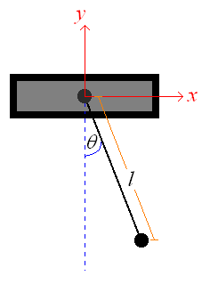
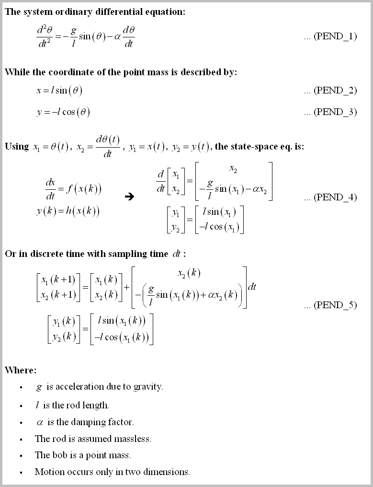
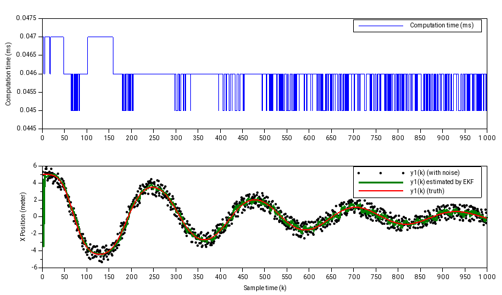

# The system description
In this example, we will implement the EKF to estimate a simple damped pendulum system. Wikipedia has good explanation for [an undamped system](https://en.wikipedia.org/wiki/Pendulum_(mathematics)#Simple_gravity_pendulum) with good animation, while [this website](http://www.nld.ds.mpg.de/applets/pendulum/eqm2.htm) has explanation for the damped one.

The variables of the system can be seen from this picture:

While the system equations can be described as:

# The implementation
First we set the system parameters in `konfig.h`:

    /* State Space dimension */
    #define SS_X_LEN    (2)
    #define SS_Z_LEN    (2)
    #define SS_U_LEN    (0)

Then we implement the state space nonlinear update & measurement function in `ekf_pend_engl.ino`:

    bool Main_bUpdateNonlinearX(Matrix &X_Next, Matrix &X, Matrix &U)
    {
        /*  The update function in discrete time:
        *      x1(k+1) = x1(k) + x2(k)*dt
        *      x2(k+1) = x2(k) - g/l*sin(x1(k))*dt - alpha*x2*dt
        */
        ...
        return true;
    }

    bool Main_bUpdateNonlinearY(Matrix &Y, Matrix &X, Matrix &U)
    {
        /*  The output (in discrete time):
        *      y1(k) =  sin(x1(k)) * l
        *      y2(k) = -cos(x1(k)) * l
        */
        ...
        return true;
    }

To demonstrate the EKF capability, we add noise at the output system (also in `ekf_pend_engl.ino`):

    /* ================== Read the sensor data / simulate the system here ================== */
    ....
    /* Let's add some noise! */
    Y[0][0] += (float((rand() % 20) - 10) / 10.);       /* add +/- 1 meters noise to x position */
    
    /* ------------------ Read the sensor data / simulate the system here ------------------ */
    
And set the EKF initial pendulum angle `(theta(k=0))` as different with the true initial pendulum angle:

    /* For example, let's set the theta(k=0) = pi/2     (i.e. the pendulum rod is parallel with the horizontal plane) */
    X_true[0][0] = 3.14159265359/2.;
    
    /* Observe that we set the wrong initial x_estimated value!  (X_EKF(k=0) != X_TRUE(k=0)) */
    X_est_init[0][0] = -3.14159265359;
    
And then plot the estimated x-position of the bob. The result, plotted using [Scilab](https://www.scilab.org/) (you can see at the beginning, the estimated value is converging to the truth despite wrong initial value):

